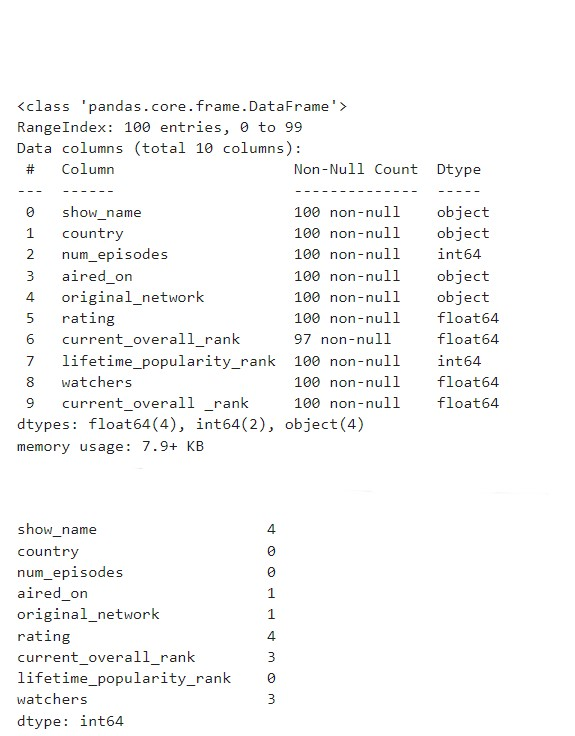

# Ex-01_DS_Data_Cleansing
# AIM:
To read the given data and perform data cleaning and save the cleaned data to a file.

# Explanation:
Data cleaning is the process of preparing data for analysis by removing or modifying data that is incorrect ,incompleted , irrelevant , duplicated or improperly formatted. Data cleaning is not simply about erasing data ,but rather finding a way to maximize datasets accuracy without necessarily deleting the information.

# ALGORITHM:

## STEP 1:
Read the given Data

## STEP 2:
Get the information about the data

## STEP 3:
Remove the null values from the data

## STEP 4:
Save the Clean data to the file

# CODE:
~~~
import pandas as pd
df=pd.read_csv("Data_set.csv")
df.head(5)

df.isnull()

df.info()

df.isnull().sum()

df['show_name']=df['show_name'].fillna(df['aired_on'].mode()[0])
df['aired_on']=df['aired_on'].fillna(df['aired_on'].mode()[0])
df['original_network']=df['original_network'].fillna(df['aired_on'].mode()[0])
df.head()

df['rating']=df['rating'].fillna(df['rating'].mean())
df['current_overall _rank']=df['current_overall_rank'].fillna(df['current_overall_rank'].mean())
df.head()

df['watchers']=df['watchers'].fillna(df['watchers'].median())
df.head()

df.info()

df.isnull().sum()

df.describe()

df.tail()

df.shape

df.columns

df.duplicated()

import seaborn as sns
sns.boxplot(x="rating",data=df)

~~~
# OUPUT:

## DATA:

## NON NULL BEFORE:

## MODE:

## MEAN:

## MEDIAN:

## NON NULL AFTER:

## DESCRIBE:

## TAIL:

## SHAPE, COLUMN LIST AND DUPLICATE:

## SNS PLOT - RATING:

### RESULT:
Thus ,the given data is read and cleansed and the cleaned data is saved into the file.
